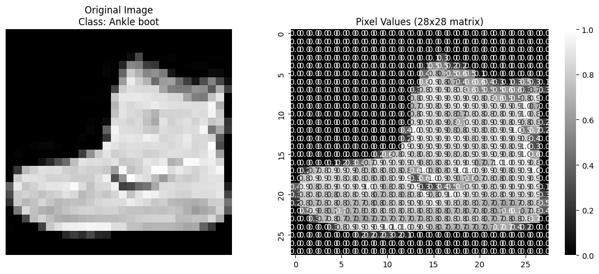
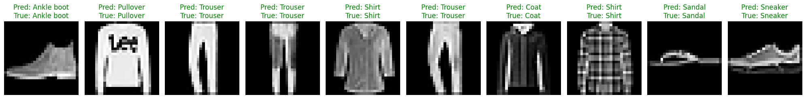

# Fashion MNIST CNN Classifier

A Convolutional Neural Network (CNN) implementation for classifying Fashion MNIST dataset using PyTorch.

<div align="center">
  
  
</div>


## Project Structure
* `data_loader.py` # Data loading and augmentation
* `model.py` # Model architecture
* `train.py` # Training script
* `utils.py` # Helper functions
* `README.md`# This file
* `requirements.txt` # List of dependencies
* `representation_images/`
    * Images of the trained model analysis and CNN steps
* `notebooks/`
    * `analysis_and_visuals.ipynb` # Visualization of the trained model analysis and CNN steps

## Setup and Installation
1. Clone the repository
2. Install requirements:
``` bash
pip install -r requirements.txt
```
## Usage
1. Train the model:
``` bash
python train.py
```

2. View analysis and visualizations in `notebooks/analysis_and_visuals.ipynb`

## Results
- Test Accuracy: 92.13%
- Training visualizations available in notebook

## Model Architecture
- 3 Convolutional blocks
- Batch normalization
- Dropout for regularization
- Adam optimizer
