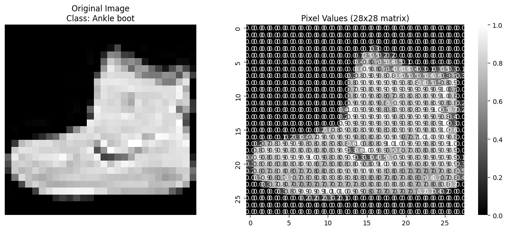

# Images of the trained model analysis and CNN steps

### Data Preprocessing
Shows how raw image data is transformed into normalized tensors suitable for neural network training.
  

### Image to Pixel Matrix Representation
Demonstrates how an image is represented as a 28x28 matrix of pixel values.
  

### Data Augmentation
Illustrates various augmentation applied to a single image.
  

### Edge Detection Convolution
Visualizes how convolution kernels detect features like edges in images.
  

### CNN Feature Maps
Shows the learned feature maps from different layers of the CNN.
  
  
### Model Predictions
Displays a sample of model predictions on test images.
  

### Accuracy by Class Analysis
Shows how the model's accuracy varies across different classes.
  

### Confusion Matrix
Visualizes the confusion matrix to understand mistakes.
  

